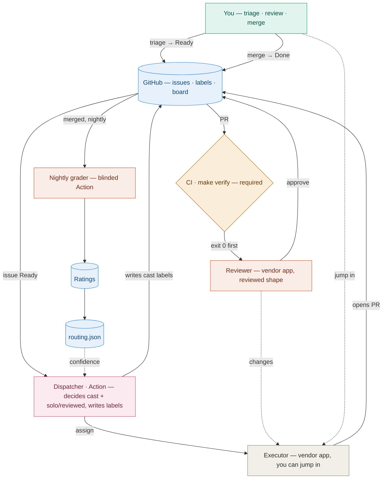
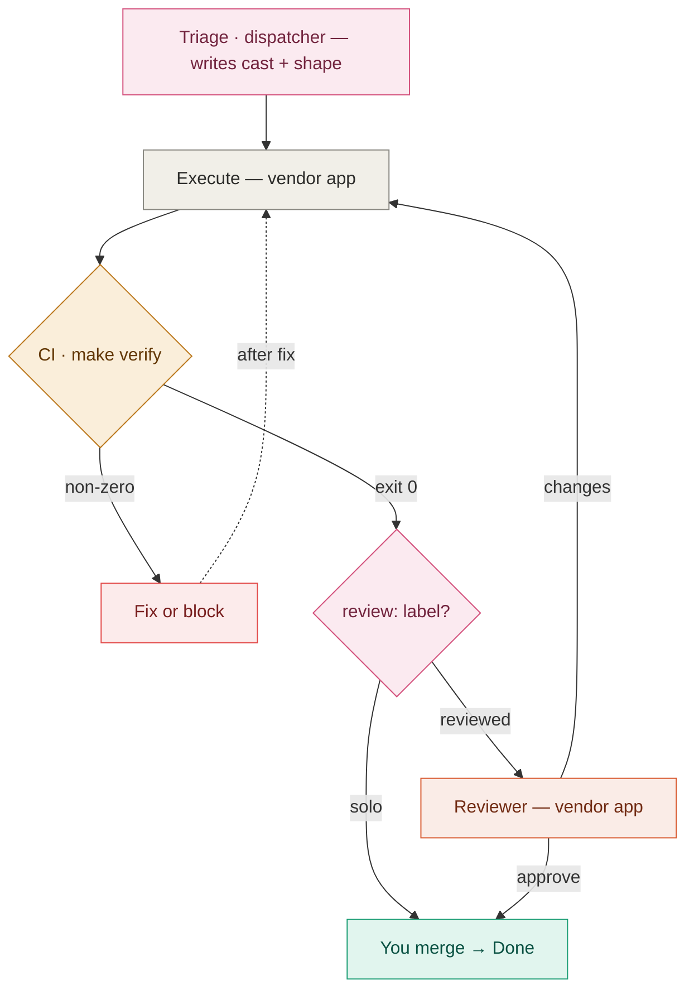

# loop-master — a GitHub-native multi-agent coding system

Run several coding agents (Codex, Claude Code, Cursor, Pi, Factory, Amp) against your backlog
without babysitting them. **GitHub is the single source of truth**: issues + labels are
canonical, and the Project board is a derived view kept in sync by automation.

## The system

GitHub is the source of truth; a dispatcher Action decides the cast and writes labels (it never executes); the assigned vendor app runs the work; CI is the gate; you merge. After merge, a nightly blinded grader turns outcomes into the routing that shapes the next cast.

## The one rule

Nothing is ever "done" on an agent's word. Only a **mechanical signal** — a passing
`make verify` (exit 0, enforced as a required CI check) or a merged PR — turns work green.
Every other claim is treated as unverified until a mechanical fact confirms it. The whole
design falls out of this.

## How work flows

Each unit of work is an issue — a **loop**: `Inbox → Ready → In Progress → Review → Done`
(`stage:blocked` is an orthogonal flag, not a column). The pipeline:

1. **Interview** *(optional)* — the planning front-door (the grill-with-docs method): grills a
   fuzzy issue into a plan, resolves terms against [CONTEXT.md](CONTEXT.md), and tags
   `difficulty`. A well-specified issue skips it and starts Ready.
2. **Dispatcher** *(a GitHub Action)* — at triage, decides the **cast** and the pipeline
   **shape** and writes labels. It *decides and labels; it never executes.*
3. **Executor** *(a vendor app)* — turns the plan into a diff and opens a PR. Runs in its own
   app, so you can jump into the live session.
4. **Gate** — `make verify` as a **required CI check**: exit 0 is the only green-able signal.
5. **Reviewer** *(a different vendor app, reviewed shape only)* — signs off on what the gate
   can't see. Reachable only on a green gate.
6. **Your merge** — the final gate; only a merge sets Done.

Two pipeline shapes, chosen per issue by the dispatcher: **solo** (one tool end-to-end) or
**reviewed** (executor + an independent reviewer). The presence of a `review:` label *is* the
shape.

### Sub-loops

An agent can spawn a **sub-loop** mid-loop — a child issue (GitHub sub-issue). The default
relationship is **block**: the parent pauses (`stage:blocked`, `blocked-by:#child`) until the
child merges, then resumes. Guardrails (depth cap, parent-merge gate, unblock-on-merge,
fan-out budget) keep recursion safe.

### The learning loop

After merge, a nightly **blinded grader** scores the work into ratings (agent × role ×
work-type) that feed a **routing table** (`routing.json`) — which drives the
dispatcher's next cast and solo/reviewed call. Mostly exploit best-fit, sometimes explore.

See the diagrams in [docs/diagrams/](docs/diagrams/).

## Repo layout

| Path | What it is |
|---|---|
| [AGENTS.md](AGENTS.md) (≡ [CLAUDE.md](CLAUDE.md)) | The agent contract — role contracts for interview / executor / reviewer. |
| [CONTEXT.md](CONTEXT.md) | Canonical vocabulary (one name, one meaning) — the glossary the interview maintains. |
| [DISPATCHER.md](DISPATCHER.md) | The coordinator spec — the triage decision, the Actions, sub-loops, the learning loop. |
| [SETUP.md](SETUP.md) | One-time human setup — Project board, repo variables/secrets, branch protection. |
| [scripts/labels.sh](scripts/labels.sh) | Idempotent label bootstrap. |
| [scripts/gh-stage.sh](scripts/gh-stage.sh) | The single controlled entry point to the Projects API. |
| [Makefile](Makefile) | `make verify` — the mechanical gate. |
| [.github/workflows/verify.yml](.github/workflows/verify.yml) | Runs `make verify` on PRs (the required check). |
| [.github/workflows/project-sync.yml](.github/workflows/project-sync.yml) | PR → board Status automation. |
| `routing.json` | The routing table (cold-start: empty). |
| [docs/diagrams/](docs/diagrams/) | `system-map.html`, `agent-flow.html` — open in a browser. |

## Getting started

Follow [SETUP.md](SETUP.md): create the Project (Status options
`Inbox / Ready / In Progress / Review / Done`), wire its built-in workflows, then per repo run
`scripts/labels.sh <owner/repo>`, set `PROJECT_OWNER` / `PROJECT_NUMBER` (variables) and
`PROJECTS_TOKEN` (secret), and make `verify` a required check on the default branch.

## Status

Built: the contract + vocabulary, the converged dispatcher spec, the label set, the
`make verify` gate (required on `main`), board automation, and the routing scaffold. The first
loop has been driven end-to-end by hand (Codex executing, Claude reviewing). **Next:** Stage 1
— automating the triage Action and the per-vendor execution adapters.

---

Commit identity for everything: `Moe Ghashim <mohanadgh@gmail.com>`.
